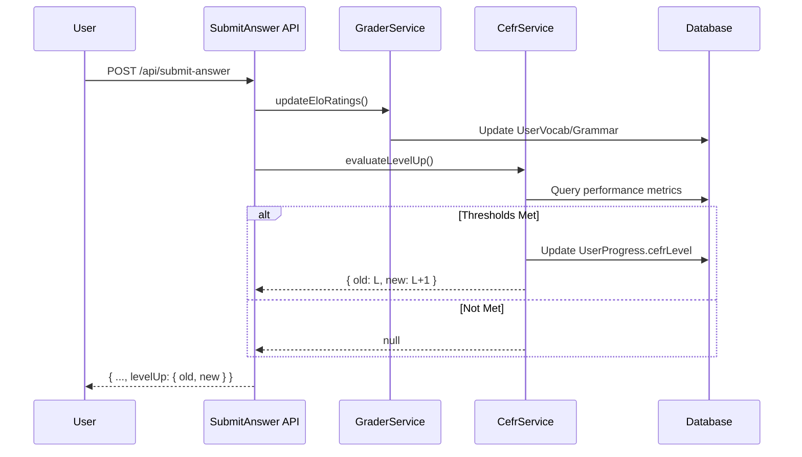

# Technical Specification: Automatic CEFR Progression System

## Overview
This document outlines the design for automatically updating a user's CEFR level based on their performance metrics in vocabulary and grammar mastery.

## 1. Level-Up Criteria
To progress from level **L** to level **L+1**, a user must meet the following quantitative thresholds:

### A. Vocabulary Mastery
- **Threshold**: ≥ 80% of vocabulary items at level **L** must be in the `MASTERED` SRS state.
- **Rationale**: Ensures a solid foundation of the current level's core vocabulary before introducing more complex terms.

### B. Grammar Mastery
- **Threshold**: ≥ 80% of grammar rules at level **L** must be in the `MASTERED` SRS state.
- **Rationale**: Ensures the user can apply the structural rules required for the current level.

### C. Performance (Elo Rating)
- **Threshold**: The average Elo rating across all `MASTERED` and `KNOWN` items at level **L** must be within 50 points of the base Elo for level **L+1**.
- **Reference Table**:
  - A1 (Base 1000) -> A2 (Target 1150+)
  - A2 (Base 1200) -> B1 (Target 1350+)
  - B1 (Base 1400) -> B2 (Target 1550+)
  - B2 (Base 1600) -> C1 (Target 1750+)
  - C1 (Base 1800) -> C2 (Target 1950+)

## 2. Architectural Integration

### CefrService (`src/lib/server/cefrService.ts`)
A new service will handle the evaluation logic.

```typescript
export class CefrService {
  static async evaluateLevelUp(userId: string, languageId: string): Promise<LevelUpdate | null> {
    // 1. Get current user level from UserProgress
    // 2. Count total Vocab & Grammar at current level
    // 3. Count user's MASTERED items at current level
    // 4. Calculate average Elo for current level items
    // 5. Compare against thresholds
    // 6. If threshold met:
    //    - Update UserProgress.cefrLevel to next level
    //    - Return { oldLevel, newLevel }
    // 7. Else return null
  }
}
```

### Triggering the Evaluation
The check should occur after an answer is submitted and performance metrics are updated.

- **Location**: [`src/routes/api/submit-answer/+server.ts`](src/routes/api/submit-answer/+server.ts)
- **Point of Insertion**: After `updateEloRatings(userId, evaluation, gameMode)` is awaited.

### Transition & User Experience
1.  **API Response**: The `submit-answer` response payload will be extended to include:
    ```json
    {
      "levelUp": { "old": "A1", "new": "A2" }
    }
    ```
2.  **Notification**: The frontend ([`src/routes/play/+page.svelte`](src/routes/play/+page.svelte)) will listen for this field and trigger a "Level Up!" celebration modal.
3.  **Content Unlocking**: New content (vocabulary and grammar rules) for the next CEFR level will automatically become available in the `LEARNING` pool once the level is updated.

## 3. Database Impacts

### Schema Changes
- **`Vocabulary`**: Add `cefrLevel String @default("A1")` to categorize words (replacing or supplementing `isBeginner`).
- **`UserProgress`**: 
    - No structural changes needed as `cefrLevel` already exists.
    - Optionally add `xpGainedAtCurrentLevel` or `lastLevelUpDate` for analytics.

### Data Migration
- A script will be required to:
    1. Update all existing `Vocabulary` items with appropriate `cefrLevel` (mapping `isBeginner: true` to `A1`).
    2. Ensure all `GrammarRule` items have their `level` correctly set.

## 4. Sequence Diagram


